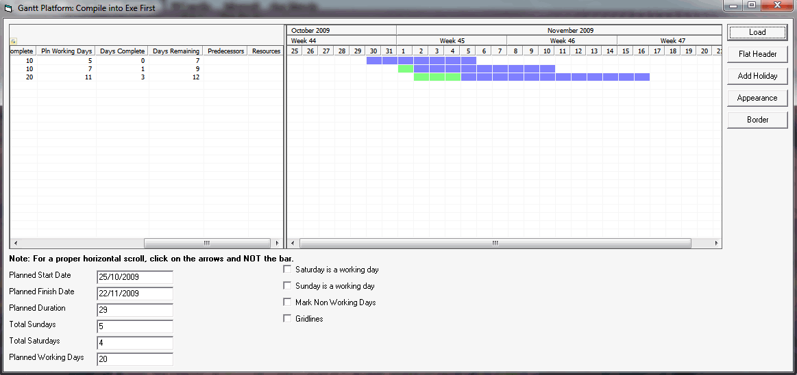



## Gantt Chart Platform Version 2

### Description

This is a gantt chart platform that I am working on. I have been looking for a gantt chart which is open source to no avail that I can easily customize. This is just the start, thus the platform. Please feel free to contribute. This demonstrates the following: subclassing listview, detect horizontal scrollbar movement, synchronize horizontal scroll bar movement, listview header tooltip, working days between two dates, addition of holidays, flat listview column header, freezing windows updates, highlighting multiple listview columns, sundays between two dates, saturdays between two dates, searching collections. Please contribute and enjoy. This version now boasts the color drawings to show progress between planned and worked until / actual. I need to only show horizontal grid lines and would appreciate any feedback on that. This is still a work in progress.
 
### More Info
 

             |
---                |---
**Submitted On**   |2009-12-04 13:24:04
**By**             |[Anele Mbanga](https://github.com/Planet-Source-Code/PSCIndex/blob/master/ByAuthor/anele-mbanga.md)
**Level**          |Advanced
**User Rating**    |5.0 (15 globes from 3 users)
**Compatibility**  |VB 6\.0
**Category**       |[Custom Controls/ Forms/  Menus](https://github.com/Planet-Source-Code/PSCIndex/blob/master/ByCategory/custom-controls-forms-menus__1-4.md)
**World**          |[Visual Basic](https://github.com/Planet-Source-Code/PSCIndex/blob/master/ByWorld/visual-basic.md)
**Archive File**   |[Gantt\_Char2169291242009\.zip](https://github.com/Planet-Source-Code/anele-mbanga-gantt-chart-platform-version-2__1-72651/archive/master.zip)

